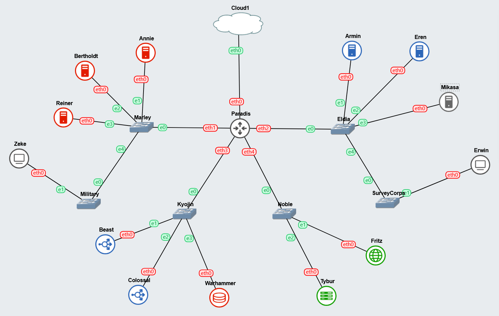
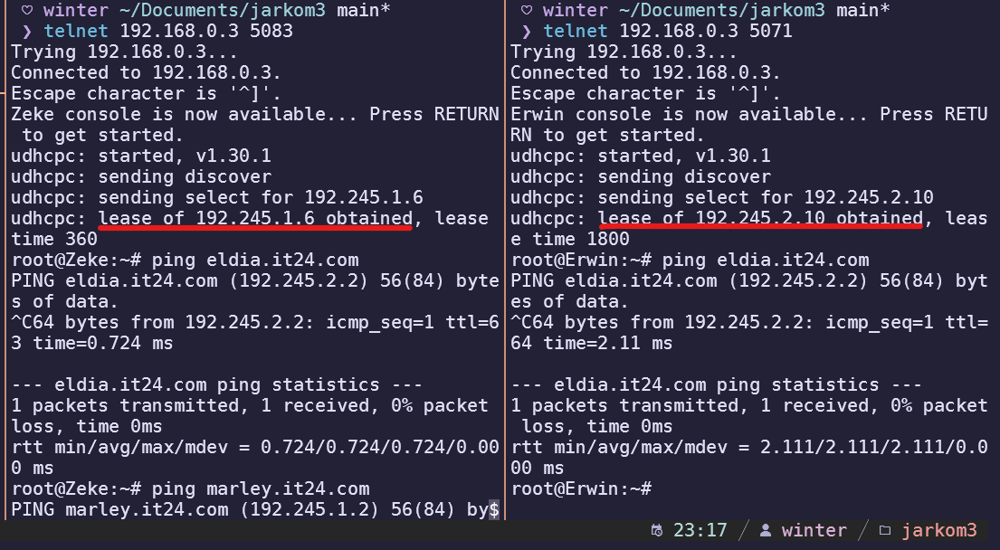
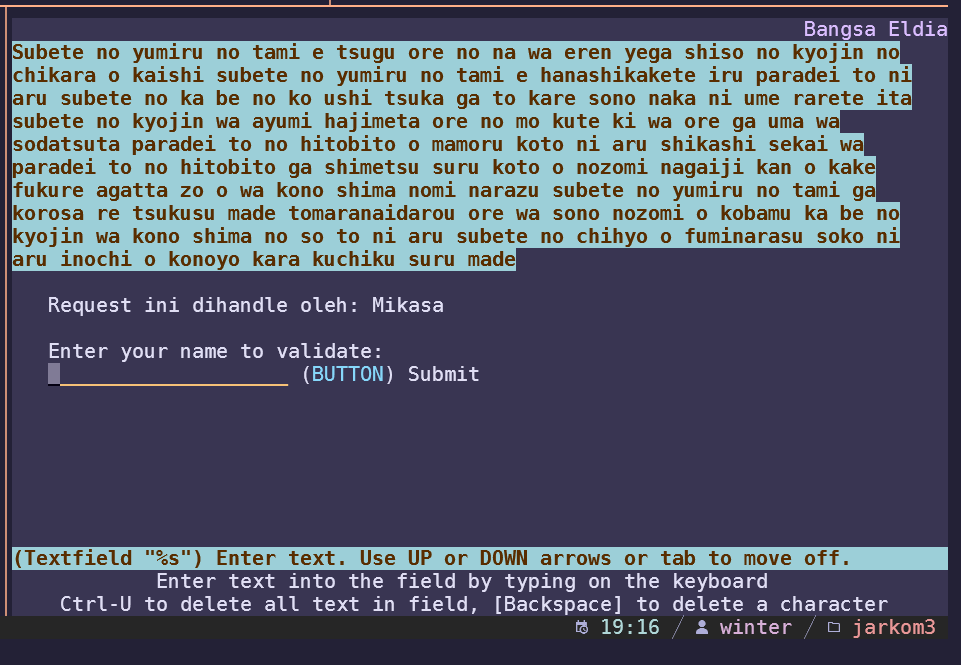
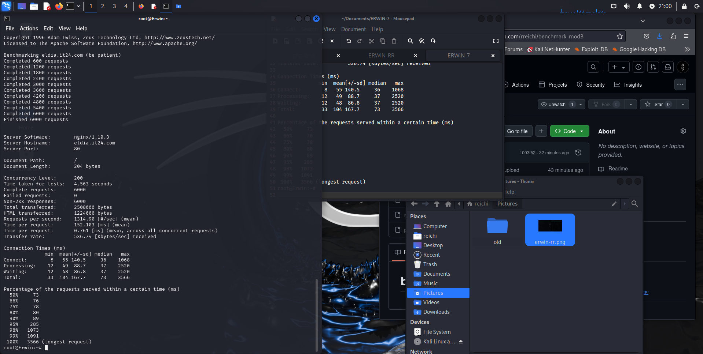
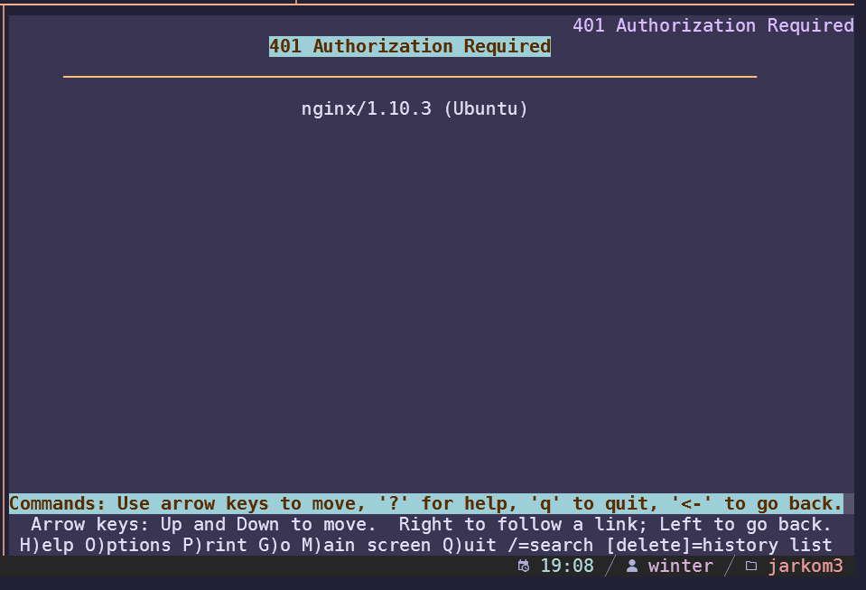
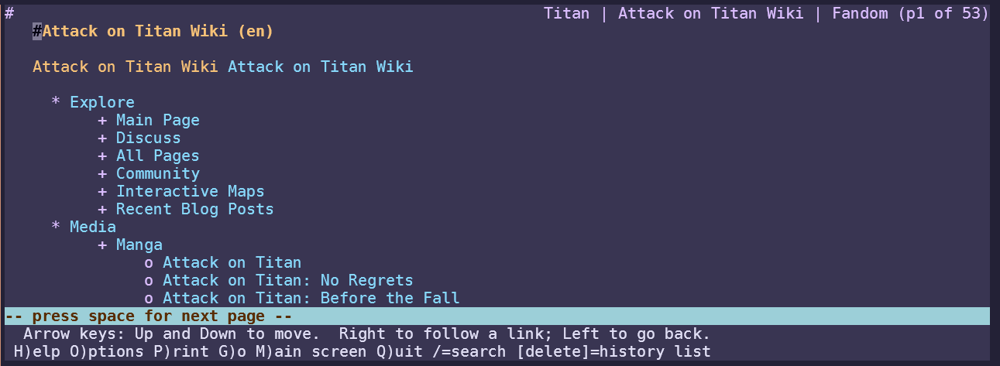
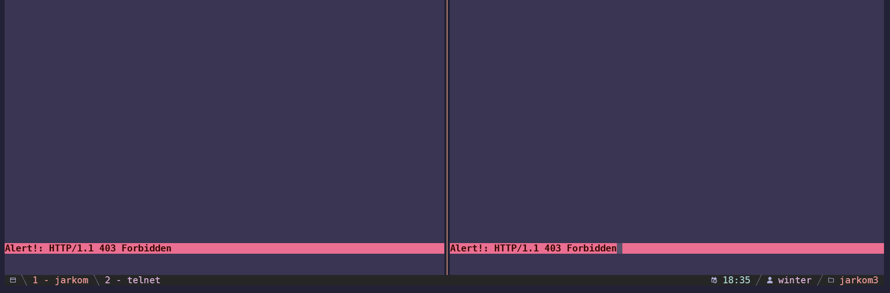
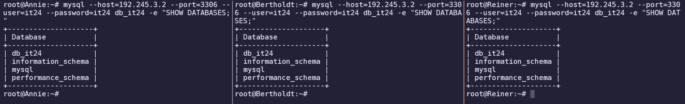

# Jarkom-Modul-3-IT24-2024

| Nama | NRP |
|---|---|
|Amoes Noland|5027231028|
|Radella Chesa Syaharani|5027231064|

## Daftar Isi

- [Jarkom-Modul-2-IT24-2024](#jarkom-modul-2-it24-2024)
	- [Daftar Isi](#daftar-isi)
	- [Pendahuluan](#pendahuluan)
	- [Topologi](#topologi)
	- [Tabel IP](#tabel-ip)
	- [Konfigurasi IP](#konfigurasi-ip)
		- [Paradis (Router/DHCP Relay)](#paradis-routerdhcp-relay)
		- [Tybur (DHCP Server)](#tybur-dhcp-server)
		- [Fritz (DNS Server)](#fritz-dns-server)
		- [Warhammer (Database Server)](#warhammer-database-server)
		- [Beast (Load Balancer Laravel)](#beast-load-balancer-laravel)
		- [Colossal (Load Balancer PHP)](#colossal-load-balancer-php)
		- [Annie (Laravel Worker)](#annie-laravel-worker)
		- [Bertholdt (Laravel Worker)](#bertholdt-laravel-worker)
		- [Reiner (Laravel Worker)](#reiner-laravel-worker)
		- [Armin (PHP Worker)](#armin-php-worker)
		- [Eren (PHP Worker)](#eren-php-worker)
		- [Mikasa (PHP Worker)](#mikasa-php-worker)
		- [Zeke (Client)](#zeke-client)
		- [Erwin (Client)](#erwin-client)
	- [Script Awal](#script-awal)
		- [Paradis (DHCP Relay)](#paradis-dhcp-relay)
		- [Fritz (DNS Server)](#fritz-dns-server-1)
		- [Tybur (DHCP Server)](#tybur-dhcp-server-1)
		- [Warhammer (Database Server)](#warhammer-database-server-1)
		- [Laravel Worker](#laravel-worker)
		- [PHP Worker](#php-worker)
		- [Load Balancer PHP](#load-balancer-php)
		- [Client](#client)
	- [Soal 0](#soal-0)
		- [Konfigurasi pada Fritz (DNS Server)](#konfigurasi-pada-fritz-dns-server)
	- [Soal 1](#soal-1)
	- [Soal 2](#soal-2)
		- [Konfigurasi pada Tybur (DHCP Server)](#konfigurasi-pada-tybur-dhcp-server)
	- [Soal 3](#soal-3)
		- [Konfigurasi pada Tybur (DHCP Server)](#konfigurasi-pada-tybur-dhcp-server-1)
	- [Soal 4](#soal-4)
		- [Konfigurasi pada Paradis (DHCP Relay)](#konfigurasi-pada-paradis-dhcp-relay)
		- [Konfigurasi pada Tybur (DHCP Server)](#konfigurasi-pada-tybur-dhcp-server-2)
	- [Soal 5](#soal-5)
		- [Konfigurasi pada Tybur (DHCP Server)](#konfigurasi-pada-tybur-dhcp-server-3)
		- [Bukti Client Terhubung](#bukti-client-terhubung)
	- [Soal 6](#soal-6)
		- [Konfigurasi pada PHP Worker](#konfigurasi-pada-php-worker)
	- [Soal 7](#soal-7)
		- [Konfigurasi pada Colossal (Load Balancer PHP)](#konfigurasi-pada-colossal-load-balancer-php)
		- [Konfigurasi pada Fritz (DNS Server)](#konfigurasi-pada-fritz-dns-server-1)
		- [Test Request](#test-request)
	- [Soal 8](#soal-8)
	- [Soal 9](#soal-9)
	- [Soal 10](#soal-10)
		- [Konfigurasi pada Colossal (Load Balancer PHP)](#konfigurasi-pada-colossal-load-balancer-php-1)
	- [Soal 11](#soal-11)
		- [Konfigurasi pada Colossal (Load Balancer PHP)](#konfigurasi-pada-colossal-load-balancer-php-2)
	- [Soal 12](#soal-12)
		- [Konfigurasi pada Colossal (Load Balancer PHP)](#konfigurasi-pada-colossal-load-balancer-php-3)
		- [Konfigurasi tambahan pada Tybur (DHCP Server)](#konfigurasi-tambahan-pada-tybur-dhcp-server)
	- [Soal 13](#soal-13)
		- [Konfigurasi pada Warhammer (Database)](#konfigurasi-pada-warhammer-database)
		- [Cara Menambahkan User](#cara-menambahkan-user)
		- [Check pada Setiap Worker](#check-pada-setiap-worker)


## Pendahuluan

Pulau Paradis dan Marley, sama-sama menghadapi ancaman besar dari satu sama lain. Keduanya membangun infrastruktur pertahanan yang kuat untuk melindungi sistem vital mereka. Dengan strategi yang matang, mereka bersiap menghadapi serangan dan mempertahankan wilayah masing-masing.

**Bangsa Marley,** dipimpin oleh **Zeke,** telah mempersiapkan **Annie, Bertholdt, dan Reiner** untuk menyerang menggunakan **Laravel Worker.** Di sisi lain, **Klan Eldia** dari **Paradis** telah mempersiapkan **Armin, Eren, dan Mikasa** sebagai **PHP Worker** untuk mempertahankan pulau tersebut. **Warhammer** bertindak sebagai **Database Server**, sementara **Beast** dan **Colossal** sebagai **Load Balancer.** 

## Topologi



## Tabel IP

| **Node**         | **Node Type**       | **Interface** | **IP Address** | **Gateway**     |
|------------------|---------------------|---------------|----------------|-----------------|
| **Paradis**      | Router/DHCP Relay   | eth0          | DHCP           | -               |
|                  |                     | eth1          | 192.245.1.1    | -               |
|                  |                     | eth2          | 192.245.2.1    | -               |
|                  |                     | eth3          | 192.245.3.1    | -               |
|                  |                     | eth4          | 192.245.4.1    | -               |
| **Tybur**        | DHCP Server         | eth0          | 192.245.4.2    | 192.245.4.1     |
| **Fritz**        | DNS Server          | eth0          | 192.245.4.3    | 192.245.4.1     |
| **Warhammer**    | Database Server     | eth0          | 192.245.3.2    | 192.245.3.1     |
| **Beast**        | Load Balancer Laravel | eth0        | 192.245.3.3    | 192.245.3.1     |
| **Colossal**     | Load Balancer PHP   | eth0          | 192.245.3.4    | 192.245.3.1     |
| **Annie**        | Laravel Worker      | eth0          | 192.245.1.2    | 192.245.1.1     |
| **Bertholdt**    | Laravel Worker      | eth0          | 192.245.1.3    | 192.245.1.1     |
| **Reiner**       | Laravel Worker      | eth0          | 192.245.1.4    | 192.245.1.1     |
| **Armin**        | PHP Worker          | eth0          | 192.245.2.2    | 192.245.2.1     |
| **Eren**         | PHP Worker          | eth0          | 192.245.2.3    | 192.245.2.1     |
| **Mikasa**       | PHP Worker          | eth0          | 192.245.2.4    | 192.245.2.1     |
| **Zeke**         | Client              | eth0          | DHCP           | -               |
| **Erwin**        | Client              | eth0          | DHCP           | -               |


## Konfigurasi IP

### Paradis (Router/DHCP Relay)
```
auto eth0
iface eth0 inet dhcp

auto eth1
iface eth1 inet static
	address 192.245.1.1
	netmask 255.255.255.0

auto eth2
iface eth2 inet static
	address 192.245.2.1
	netmask 255.255.255.0

auto eth3
iface eth3 inet static
	address 192.245.3.1
	netmask 255.255.255.0

auto eth4
iface eth4 inet static
	address 192.245.4.1
	netmask 255.255.255.0
```

### Tybur (DHCP Server)
```
auto eth0
iface eth0 inet static
	address 192.245.4.2
	netmask 255.255.255.0
	gateway 192.245.4.1
```

### Fritz (DNS Server)
```
auto eth0
iface eth0 inet static
	address 192.245.4.3
	netmask 255.255.255.0
	gateway 192.245.4.1
```

### Warhammer (Database Server)
```
auto eth0
iface eth0 inet static
	address 192.245.3.2
	netmask 255.255.255.0
	gateway 192.245.3.1
```

### Beast (Load Balancer Laravel)
```
auto eth0
iface eth0 inet static
	address 192.245.3.3
	netmask 255.255.255.0
	gateway 192.245.3.1
```

### Colossal (Load Balancer PHP)
```
auto eth0
iface eth0 inet static
	address 192.245.3.4
	netmask 255.255.255.0
	gateway 192.245.3.1
```

### Annie (Laravel Worker)
```
auto eth0
iface eth0 inet static
	address 192.245.1.2
	netmask 255.255.255.0
	gateway 192.245.1.1
```

### Bertholdt (Laravel Worker)
```
auto eth0
iface eth0 inet static
	address 192.245.1.3
	netmask 255.255.255.0
	gateway 192.245.1.1
```

### Reiner (Laravel Worker)
```
auto eth0
iface eth0 inet static
	address 192.245.1.4
	netmask 255.255.255.0
	gateway 192.245.1.1
```

### Armin (PHP Worker)
```
auto eth0
iface eth0 inet static
	address 192.245.2.2
	netmask 255.255.255.0
	gateway 192.245.2.1
```

### Eren (PHP Worker)
```
auto eth0
iface eth0 inet static
	address 192.245.2.3
	netmask 255.255.255.0
	gateway 192.245.2.1
```

### Mikasa (PHP Worker)
```
auto eth0
iface eth0 inet static
	address 192.245.2.4
	netmask 255.255.255.0
	gateway 192.245.2.1
```

### Zeke (Client)
```
auto eth0
iface eth0 inet dhcp
hwaddress ether 7a:47:21:fc:07:a4
```

### Erwin (Client)
```
auto eth0
iface eth0 inet dhcp
hwaddress ether ba:89:d6:0f:57:f8
```

## Script Awal

### Paradis (DHCP Relay)
```sh
iptables -t nat -A POSTROUTING -o eth0 -j MASQUERADE -s 192.245.0.0/16
echo nameserver 192.168.122.1 > /etc/resolv.conf
apt-get update
apt-get install isc-dhcp-relay -y
service isc-dhcp-relay start
```

### Fritz (DNS Server)
```sh
echo 'nameserver 192.168.122.1' > /etc/resolv.conf
apt-get update
apt-get install bind9 -y  
```

### Tybur (DHCP Server)
```sh
echo 'nameserver 192.245.4.3' > /etc/resolv.conf   # DNS Server 
apt-get update
apt install isc-dhcp-server -y
```

### Warhammer (Database Server)
```sh
echo 'nameserver 192.245.4.3' > /etc/resolv.conf   # DNS Server 
apt-get update
apt-get install mariadb-server -y
service mysql start
```

### Laravel Worker
```sh
echo 'nameserver 192.245.4.3' > /etc/resolv.conf   # DNS Server 
apt-get update
apt-get install mariadb-client -y
```
### PHP Worker
```sh
echo 'nameserver 192.245.4.3' > /etc/resolv.conf   # DNS Server 
apt-get update
apt-get install nginx -y
apt-get install wget unzip -y
apt-get install php7.3-fpm php7.3-common php7.3-mysql php7.3-gmp php7.3-curl php7.3-intl php7.3-mbstring php7.3-xmlrpc php7.3-gd php7.3-xml php7.3-cli php7.3-zip -y
```

### Load Balancer PHP
```sh
echo 'nameserver 192.245.4.3' > /etc/resolv.conf   # DNS Server 
apt-get update
apt-get install nginx -y
```

### Client
```
apt-get update
```

## Soal 0

> Pulau Paradis telah menjadi tempat yang damai selama 1000 tahun, namun kedamaian tersebut tidak bertahan selamanya. Perang antara kaum Marley dan Eldia telah mencapai puncak. Kaum Marley yang dipimpin oleh Zeke, me-register domain name **marley.yyy.com** untuk worker Laravel mengarah pada **Annie**. Namun ternyata tidak hanya kaum Marley saja yang berinisiasi, kaum Eldia ternyata sudah mendaftarkan domain name **eldia.yyy.com** untuk worker PHP (0) mengarah pada **Armin**.

### Konfigurasi pada Fritz (DNS Server)

```sh
echo 'zone "marley.it24.com" {
    type master;
    file "/etc/bind/sites/marley.it24.com";
};
zone "eldia.it24.com" {
    type master;
    file "/etc/bind/sites/eldia.it24.com";
};' > /etc/bind/named.conf.local

mkdir -p /etc/bind/sites
cp /etc/bind/db.local /etc/bind/sites/marley.it24.com
cp /etc/bind/db.local /etc/bind/sites/eldia.it24.com

echo ';
; BIND data file for local loopback interface
;
$TTL    604800
@       IN      SOA     marley.it24.com. root.marley.it24.com. (
                        2024102301      ; Serial
                        604800         ; Refresh
                        86400         ; Retry
                        2419200         ; Expire
                        604800 )       ; Negative Cache TTL
;
@       IN      NS      marley.it24.com.
@       IN      A       192.245.1.2    ; IP Annie
www     IN      CNAME   marley.it24.com.' > /etc/bind/sites/marley.it24.com

echo ';
; BIND data file for local loopback interface
;
$TTL    604800
@       IN      SOA     eldia.it24.com. root.eldia.it24.com. (
                            2024102301         ; Serial
                            604800              ; Refresh
                            86400              ; Retry
                            2419200              ; Expire
                            604800 )            ; Negative Cache TTL
;
@       IN      NS      eldia.it24.com.
@       IN      A       192.245.2.2    ; IP Armin
www     IN      CNAME   eldia.it24.com.' > /etc/bind/sites/eldia.it24.com

echo 'options {
    directory "/var/cache/bind";

    forwarders {
        192.168.122.1;
    };

    // dnssec-validation auto;

    allow-query { any; };
    auth-nxdomain no;    # conform to RFC1035
    listen-on-v6 { any; };
};' > /etc/bind/named.conf.options

service bind9 restart
```

## Soal 1

> Lakukan konfigurasi sesuai dengan peta yang sudah diberikan.

* [Topologi](#topologi)
* [Tabel IP](#tabel-ip)
* [Konfigurasi IP](#konfigurasi-ip)

## Soal 2

> Client yang melalui bangsa marley mendapatkan range IP dari [prefix IP].1.05 - [prefix IP].1.25 dan [prefix IP].1.50 - [prefix IP].1.100

### Konfigurasi pada Tybur (DHCP Server)

```sh
echo '
subnet 192.245.1.0 netmask 255.255.255.0 {
range 192.245.1.5 192.245.1.25;
range 192.245.1.50 192.245.1.100;
}
' > /etc/dhcp/dhcpd.conf

service isc-dhcp-server restart
```

## Soal 3

> Client yang melalui bangsa eldia mendapatkan range IP dari [prefix IP].2.09 - [prefix IP].2.27 dan [prefix IP].2 .81 - [prefix IP].2.243

### Konfigurasi pada Tybur (DHCP Server)

```sh
echo '
subnet 192.245.1.0 netmask 255.255.255.0 {
	range 192.245.1.5 192.245.1.25;
	range 192.245.1.50 192.245.1.100;
}

subnet 192.245.2.0 netmask 255.255.255.0 {
	range 192.245.2.09 192.245.2.27;
	range 192.245.2.81 192.245.2.243;
}
' > /etc/dhcp/dhcpd.conf

service isc-dhcp-server restart
```

## Soal 4

> Client mendapatkan DNS dari keluarga Fritz dan dapat terhubung dengan internet melalui DNS tersebut 

### Konfigurasi pada Paradis (DHCP Relay)
```sh
echo '
SERVERS="192.245.4.2"
INTERFACES="eth1 eth2 eth3 eth4"
OPTIONS=""
' > /etc/default/isc-dhcp-relay

echo '
net.ipv4.ip_forward=1
' > /etc/sysctl.conf

service isc-dhcp-relay restart
```

### Konfigurasi pada Tybur (DHCP Server)
```sh
echo '
INTERFACESv4="eth0"
INTERFACESv6=""
' > /etc/default/isc-dhcp-server

echo '
subnet 192.245.1.0 netmask 255.255.255.0 {
	range 192.245.1.05 192.245.1.25;
	range 192.245.1.50 192.245.1.100;
	option routers 192.245.1.1;
	option broadcast-address 192.245.1.255;
	option domain-name-servers 192.245.4.3;
}

subnet 192.245.2.0 netmask 255.255.255.0 {
	range 192.245.2.09 192.245.2.27;
	range 192.245.2.81 192.245.2.243;
	option routers 192.245.2.1;
	option broadcast-address 192.245.1.255;
	option domain-name-servers 192.245.4.3;
}

subnet 192.245.3.0 netmask 255.255.255.0 {
	option routers 192.245.3.1;
}

subnet 192.245.4.0 netmask 255.255.255.0 {
	option routers 192.245.4.1;
}
' > /etc/dhcp/dhcpd.conf

service isc-dhcp-server restart
```

## Soal 5

> Dikarenakan keluarga Tybur tidak menyukai kaum eldia, maka mereka hanya meminjamkan ip address ke kaum eldia selama 6 menit. Namun untuk kaum marley, keluarga Tybur meminjamkan ip address selama 30 menit. Waktu maksimal dialokasikan untuk peminjaman alamat IP selama 87 menit.

Sedikit matematika diperlukan dalam menambahkan lease time pada setiap client yang terhubung:
* `6 menit * 60 detik = 360 detik`
* `30 menit * 60 detik = 1800 detik`
* `87 menit * 60 detik = 5220 detik`

### Konfigurasi pada Tybur (DHCP Server)
```sh
echo '
INTERFACESv4="eth0"
INTERFACESv6=""
' > /etc/default/isc-dhcp-server

echo '
subnet 192.245.1.0 netmask 255.255.255.0 {
	range 192.245.1.5 192.245.1.25;
	range 192.245.1.50 192.245.1.100;
	option routers 192.245.1.1;
	option broadcast-address 192.245.1.255;
	option domain-name-servers 192.245.4.3;
	default-lease-time 360;
	max-lease-time 5220;
}

subnet 192.245.2.0 netmask 255.255.255.0 {
	range 192.245.2.9 192.245.2.27;
	range 192.245.2.81 192.245.2.243;
	option routers 192.245.2.1;
	option broadcast-address 192.245.1.255;
	option domain-name-servers 192.245.4.3;
	default-lease-time 1800;
	max-lease-time 5220;
}

subnet 192.245.3.0 netmask 255.255.255.0 {
	option routers 192.245.3.1;
}

subnet 192.245.4.0 netmask 255.255.255.0 {
	option routers 192.245.4.1;
}
' > /etc/dhcp/dhcpd.conf

service isc-dhcp-server restart
```

### Bukti Client Terhubung



## Soal 6

> Armin berinisiasi untuk memerintahkan setiap worker PHP untuk melakukan konfigurasi virtual host untuk website berikut https://intip.in/BangsaEldia dengan menggunakan php 7.3 

### Konfigurasi pada PHP Worker

```sh
service nginx start
service php7.3-fpm start

mkdir -p /var/www/eldia.it24.com

wget --no-check-certificate 'https://drive.google.com/uc?export=download&id=1TvebIeMQjRjFURKVtA32lO9aL7U2msd6' -O /root/bangsaEldia.zip
unzip -o /root/bangsaEldia.zip -d /var/www/eldia.it24.com

cp /etc/nginx/sites-available/default /etc/nginx/sites-available/eldia.it24.com
ln -s /etc/nginx/sites-available/eldia.it24.com /etc/nginx/sites-enabled/
rm /etc/nginx/sites-enabled/default

echo '
server {
  listen 80;
  listen [::]:80;

  root /var/www/eldia.it24.com;
  index index.php index.html index.htm;

  server_name eldia.it24.com;

  location / {
    try_files $uri $uri/ =404;
  }

  location ~ \.php$ {
    include snippets/fastcgi-php.conf;
    fastcgi_pass unix:/var/run/php/php7.3-fpm.sock;
  }

  location ~ /\.ht {
    deny all;
  }
}' > /etc/nginx/sites-available/eldia.it24.com

service nginx restart
```

Bila website sudah terhubung dengan baik, maka ini akan terlihat:



## Soal 7

> Dikarenakan Armin sudah mendapatkan kekuatan titan colossal, maka bantulah kaum eldia menggunakan colossal agar dapat bekerja sama dengan baik. Kemudian lakukan testing dengan 6000 request dan 200 request/second. 

### Konfigurasi pada Colossal (Load Balancer PHP)
```sh
cp /etc/nginx/sites-available/default /etc/nginx/sites-available/lb_php

echo ' upstream worker {
        #least_conn;
        #ip_hash;
    server 192.245.2.2;
    server 192.245.2.3;
    server 192.245.2.4;
}

server {
    listen 80;
    server_name eldia.it24.com www.eldia.it24.com;

    root /var/www/html;

    index index.html index.htm index.nginx-debian.html index.php;

    server_name _;

    location / {
        proxy_pass http://worker;
    }
} ' > /etc/nginx/sites-available/lb_php

ln -s /etc/nginx/sites-available/lb_php /etc/nginx/sites-enabled/
rm /etc/nginx/sites-enabled/default

service nginx restart
```

### Konfigurasi pada Fritz (DNS Server)

Ubah untuk mengarahkan eldia.it24.com ke IP Colossal (Load Balancer PHP)

```sh
echo 'zone "marley.it24.com" {
    type master;
    file "/etc/bind/sites/marley.it24.com";
};
zone "eldia.it24.com" {
    type master;
    file "/etc/bind/sites/eldia.it24.com";
};' > /etc/bind/named.conf.local

mkdir -p /etc/bind/sites
cp /etc/bind/db.local /etc/bind/sites/marley.it24.com
cp /etc/bind/db.local /etc/bind/sites/eldia.it24.com

echo ';
; BIND data file for local loopback interface
;
$TTL    604800
@       IN      SOA     marley.it24.com. root.marley.it24.com. (
                        2024102301      ; Serial
                        604800         ; Refresh
                        86400         ; Retry
                        2419200         ; Expire
                        604800 )       ; Negative Cache TTL
;
@       IN      NS      marley.it24.com.
@       IN      A       192.245.1.2    ; IP Annie
www     IN      CNAME   marley.it24.com.' > /etc/bind/sites/marley.it24.com

echo ';
; BIND data file for local loopback interface
;
$TTL    604800
@       IN      SOA     eldia.it24.com. root.eldia.it24.com. (
                            2024102301         ; Serial
                            604800              ; Refresh
                            86400              ; Retry
                            2419200              ; Expire
                            604800 )            ; Negative Cache TTL
;
@       IN      NS      eldia.it24.com.
@       IN      A       192.245.3.4    ; IP Colossal
www     IN      CNAME   eldia.it24.com.' > /etc/bind/sites/eldia.it24.com

echo 'options {
    directory "/var/cache/bind";

    forwarders {
        192.168.122.1;
    };

    // dnssec-validation auto;

    allow-query { any; };
    auth-nxdomain no;    # conform to RFC1035
    listen-on-v6 { any; };
};' > /etc/bind/named.conf.options

service bind9 restart
```
### Test Request


## Soal 8

> Karena Erwin meminta “laporan kerja Armin”, maka dari itu buatlah analisis hasil testing dengan 1000 request dan 75 request/second untuk masing-masing algoritma Load Balancer dengan ketentuan sebagai berikut:

> a. Nama Algoritma Load Balancer

> b. Report hasil testing pada Apache Benchmark

> c. Grafik request per second untuk masing masing algoritma. 

> d. Analisis

Benchmarking dan Report: [Laporan Kerja Armin](benchmarking.md)

## Soal 9

> Dengan menggunakan algoritma Least-Connection, lakukan testing dengan menggunakan 3 worker, 2 worker, dan 1 worker sebanyak 1000 request dengan 10 request/second, kemudian tambahkan grafiknya pada “laporan kerja Armin”.

Benchmarking dan Report: [Laporan Kerja Armin](benchmarking.md)
## Soal 10

> Selanjutnya coba tambahkan keamanan dengan konfigurasi autentikasi di Colossal dengan dengan kombinasi username: “arminannie” dan password: “jrkmyyy”, dengan yyy merupakan kode kelompok. Terakhir simpan file “htpasswd” nya di /etc/nginx/supersecret/ 

### Konfigurasi pada Colossal (Load Balancer PHP)
```sh
mkdir -p /etc/nginx/supersecret
htpasswd -b -c /etc/nginx/supersecret/htpasswd arminannie jrkmit24

cp /etc/nginx/sites-available/default /etc/nginx/sites-available/lb_php

echo ' upstream worker {
        #least_conn;
        #ip_hash;
    server 192.245.2.2;
    server 192.245.2.3;
    server 192.245.2.4;
}

server {
    listen 80;
    server_name eldia.it24.com www.eldia.it24.com;

    root /var/www/html;

    index index.html index.htm index.nginx-debian.html index.php;

    server_name _;

    location / {
        proxy_pass http://worker;
    }

    auth_basic "Restricted Content";
    auth_basic_user_file /etc/nginx/supersecret/htpasswd;
} ' > /etc/nginx/sites-available/lb_php

ln -s /etc/nginx/sites-available/lb_php /etc/nginx/sites-enabled/
rm /etc/nginx/sites-enabled/default

service nginx restart
```

Akan muncul kegagalan auth bila salah kredensial:



## Soal 11

> Lalu buat untuk setiap request yang mengandung /titan akan di proxy passing menuju halaman https://attackontitan.fandom.com/wiki/Attack_on_Titan_Wiki hint: (proxy_pass)

### Konfigurasi pada Colossal (Load Balancer PHP)
```sh
mkdir -p /etc/nginx/supersecret
htpasswd -b -c /etc/nginx/supersecret/htpasswd arminannie jrkmit24

cp /etc/nginx/sites-available/default /etc/nginx/sites-available/lb_php

echo ' upstream worker {
        #least_conn;
        #ip_hash;
    server 192.245.2.2;
    server 192.245.2.3;
    server 192.245.2.4;
}

server {
    listen 80;
    server_name eldia.it24.com www.eldia.it24.com;

    root /var/www/html;

    index index.html index.htm index.nginx-debian.html index.php;

    server_name _;

    location / {
        proxy_pass http://worker;
    }

    location /titan {
        proxy_pass http://attackontitan.fandom.com;
        proxy_set_header Host attackontitan.fandom.com;
        proxy_set_header X-Real-IP $remote_addr;
        proxy_set_header X-Forwarded-For $proxy_add_x_forwarded_for;
        proxy_set_header X-Forwarded-Proto $scheme;
    }

    auth_basic "Restricted Content";
    auth_basic_user_file /etc/nginx/supersecret/htpasswd;
} ' > /etc/nginx/sites-available/lb_php

ln -s /etc/nginx/sites-available/lb_php /etc/nginx/sites-enabled/
rm /etc/nginx/sites-enabled/default

service nginx restart
```

Akan terlihat Attack on Titan wiki bila memasukkan `lynx eldia.it24.com/titan`:



## Soal 12

> Selanjutnya Colossal ini hanya boleh diakses oleh client dengan IP [Prefix IP].1.77, [Prefix IP].1.88, [Prefix IP].2.144, dan [Prefix IP].2.156. hint: (fixed in dulu clientnya)

### Konfigurasi pada Colossal (Load Balancer PHP)
```sh
mkdir -p /etc/nginx/supersecret
htpasswd -b -c /etc/nginx/supersecret/htpasswd arminannie jrkmit24

cp /etc/nginx/sites-available/default /etc/nginx/sites-available/lb_php

echo ' upstream worker {
        #least_conn;
        #ip_hash;
    server 192.245.2.2;
    server 192.245.2.3;
    server 192.245.2.4;
}

server {
    listen 80;
    server_name eldia.it24.com www.eldia.it24.com;

    root /var/www/html;

    index index.html index.htm index.nginx-debian.html index.php;

    server_name _;

    location / {
        allow 192.245.1.77;
        allow 192.245.1.88;
        allow 192.245.2.144;
        allow 192.245.2.156;
        deny all;
        proxy_pass http://worker;
    }

    location /titan {
        proxy_pass http://attackontitan.fandom.com;
        proxy_set_header Host attackontitan.fandom.com;
        proxy_set_header X-Real-IP $remote_addr;
        proxy_set_header X-Forwarded-For $proxy_add_x_forwarded_for;
        proxy_set_header X-Forwarded-Proto $scheme;
    }

    auth_basic "Restricted Content";
    auth_basic_user_file /etc/nginx/supersecret/htpasswd;
} ' > /etc/nginx/sites-available/lb_php

ln -s /etc/nginx/sites-available/lb_php /etc/nginx/sites-enabled/
rm /etc/nginx/sites-enabled/default

service nginx restart
```

Bila IP tidak sesuai maka akan muncul sebagai berikut:



### Konfigurasi tambahan pada Tybur (DHCP Server)

Hanya untuk testing pada client agar IP tetap fixed, dan pastikan untuk menambahkan fixed hardware ethernet pada konfigurasi IP. Bisa dicomment bila ingin melihat pesan gagal.

```conf
host Zeke {
    hardware ethernet 7a:47:21:fc:07:a4;
    fixed-address 192.245.1.77;
}

host Erwin {
    hardware ethernet ba:89:d6:0f:57:f8;
    fixed-address 192.245.2.144;
}
```

## Soal 13

### Konfigurasi pada Warhammer (Database)
```sh
apt-get update
apt-get install mariadb-server -y
service mysql start

echo '# This group is read both by the client and the server
# use it for options that affect everything
[client-server]

# Import all .cnf files from configuration directory
!includedir /etc/mysql/conf.d/
!includedir /etc/mysql/mariadb.conf.d/

# Options affecting the MySQL server (mysqld)
[mysqld]
skip-networking=0
skip-bind-address
' > /etc/mysql/my.cnf 

sed -i 's/127.0.0.1/0.0.0.0/g' /etc/mysql/mariadb.conf.d/50-server.cnf

service mysql restart
```

### Cara Menambahkan User

Set up root user tanpa password (wow sangat tidak secure!):

```
mysql -u root -p
Enter password: (kosong)

Menambahkan user it24 pada database:

```mysql
CREATE USER 'it24'@'%' IDENTIFIED BY 'it24';
CREATE USER 'it24'@'localhost' IDENTIFIED BY 'it24';
CREATE DATABASE db_it24;
GRANT ALL PRIVILEGES ON *.* TO 'it24'@'%';
GRANT ALL PRIVILEGES ON *.* TO 'it24'@'localhost';
FLUSH PRIVILEGES;
```

### Check pada Setiap Worker

Untuk memastikan setiap worker "Laravel" dapat connect kepada database yang dibuat dalam Warhammer:

```
mysql --host=192.245.3.2 --port=3306 --user=it24 --password=it24 db_it24 -e "SHOW DATABASES;"
```


