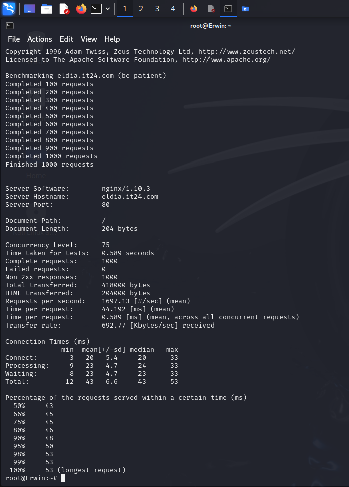
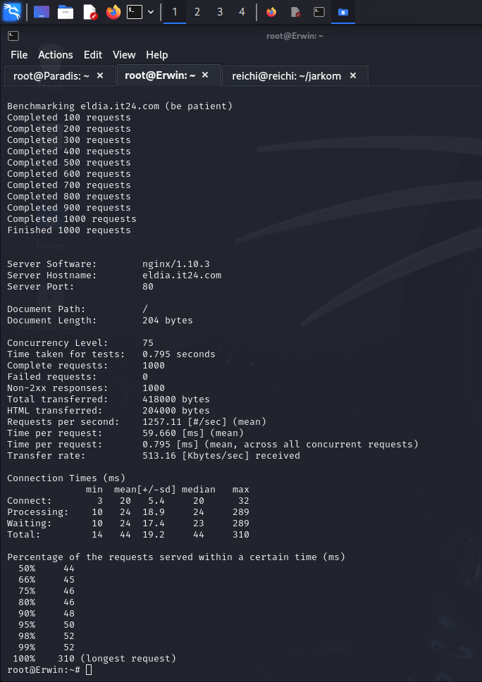
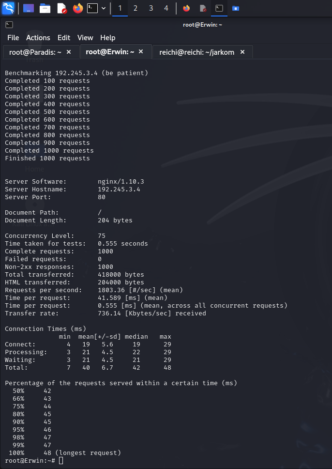

## Testing Load Balancer

### Script Colossal (Load Balancer PHP)

```sh
mkdir -p /etc/nginx/supersecret
htpasswd -b -c /etc/nginx/supersecret/htpasswd arminannie jrkmit24

cp /etc/nginx/sites-available/default /etc/nginx/sites-available/lb_php

echo ' upstream worker {
        #least_conn;
        #ip_hash;
    server 192.245.2.2;
    server 192.245.2.3;
    server 192.245.2.4;
}

server {
    listen 80;
    server_name eldia.it24.com www.eldia.it24.com;

    root /var/www/html;

    index index.html index.htm index.nginx-debian.html index.php;

    server_name _;

    location / {
        proxy_pass http://worker;
    }

    auth_basic "Restricted Content";
    auth_basic_user_file /etc/nginx/supersecret/htpasswd;
} ' > /etc/nginx/sites-available/lb_php

ln -s /etc/nginx/sites-available/lb_php /etc/nginx/sites-enabled/
rm /etc/nginx/sites-enabled/default

service nginx restart
```
#### Round Robin

#### Least Connection

#### IP Hash


### Analisis
- Performa Tertinggi: Metode IP Hash memiliki jumlah request per detik tertinggi dengan 1803.36 request/detik, dengan waktu per request rata-rata yang lebih rendah (0.555 ms) dan transfer rate yang lebih tinggi (736.14 Kbytes/sec). Ini menunjukkan performa yang lebih baik dibandingkan dua metode lainnya.
- Stabilitas Waktu Respon: Metode IP Round Robin juga menunjukkan performa yang baik dengan waktu per request rata-rata yang cukup rendah, yaitu 0.589 ms, tetapi sedikit lebih lambat dibandingkan IP Hash.
- Performa Terendah: Metode Least Connections memiliki jumlah request per detik yang paling rendah (1257.11 request/detik) dan waktu per request yang lebih tinggi (0.795 ms). Selain itu, terdapat variasi waktu yang signifikan pada processing time dan waiting time, terutama dengan nilai maksimum mencapai 310 ms untuk request terpanjang.